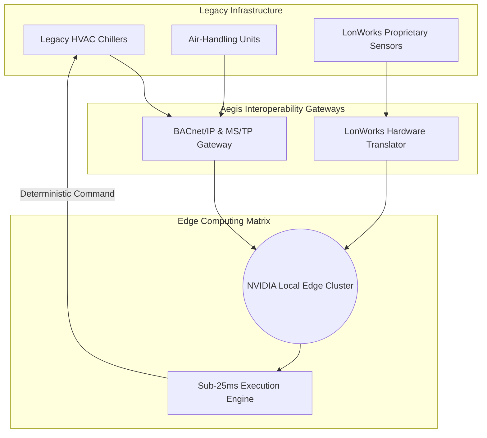
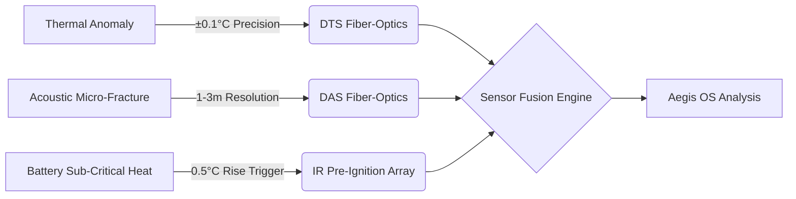
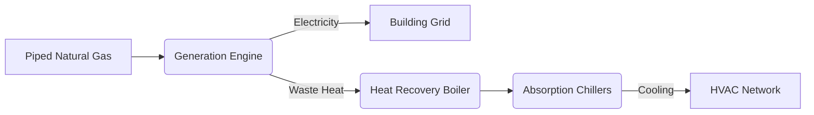
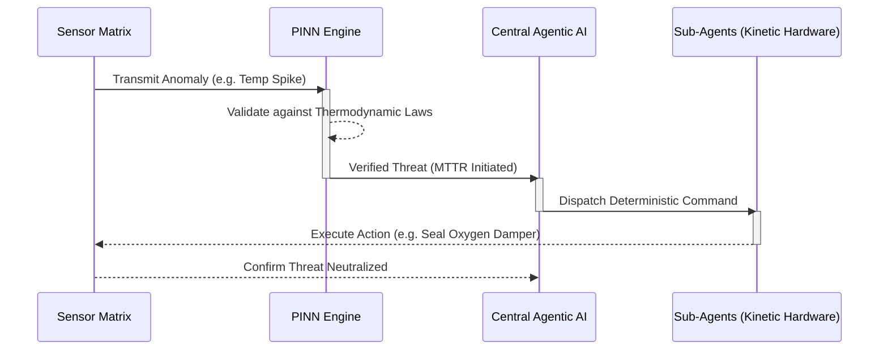
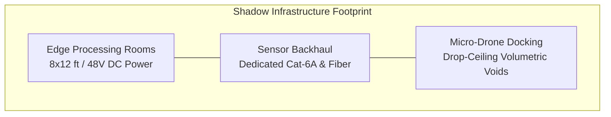

# Aegis Tower: Executive Project Report

**Project Classification:** CONFIDENTIAL / STRATEGIC INFRASTRUCTURE  
**Asset:** Aegis Tower (26-Floor Autonomous Habitat)  
**Status:** Final Implementation Design Phase  

---

## 1. Executive Summary

Aegis Tower represents a paradigm shift in structural engineering and facility management. Moving beyond the passive "smart city" concepts of the last decade, Aegis Tower is a deterministic, self-healing 26-floor structural nervous system. By integrating a sophisticated Agentic Control Plane, Physics-Informed Neural Networks (PINN), and autonomous mechanical intervention fleets, the tower eliminates the latency inherent in human-in-the-loop facility management. It actively predicts, analyzes, and neutralizes structural, thermal, and operational threats in milliseconds, transforming a depreciating physical asset into a state of operational immortality.

---

## 2. Communication & Interoperability Layer

To ensure the Aegis system can be retrofitted onto legacy high-rises (such as the Mumbai operational baseline), specific connectivity protocols allow the Aegis OS to communicate with existing building infrastructure.

* **BACnet/IP & MS/TP:** The system utilizes BACnet for standardized communication with existing Building Management Systems (BMS), allowing Aegis to command legacy HVAC chillers, air-handling units, and fan coil units.
* **LonWorks Integration:** For older assets utilizing LonWorks protocols, Aegis OS employs specialized hardware gateways to translate proprietary sensor data into the Aegis deterministic matrix.
* **Edge-to-Cloud Latency:** By processing telemetry on local NVIDIA-based edge clusters, the Aegis OS achieves a local execution latency of **<25ms** for mechanical interventions, effectively neutralizing the latency inherent in cloud-dependent systems.

---

## 3. Hardware & Physical Infrastructure Envelope

The platform utilizes a multi-layered hardware approach designed to ensure absolute asset visibility and immediate autonomous mechanical control.

### A. Sensory Nervous System & Data Precision
The tower is saturated with a dense matrix of diagnostic sensors, functioning as an omnipresent nervous system engineered for superior "Mean Time To Identify" (MTTI) capabilities:

* **Fiber-Optic Distributed Acoustic Sensing (DAS):** Operates at high-frequency sampling (kHz range) alongside Luna ODISI fiber-optic cables to detect the unique acoustic signatures of pressurized water escaping a pipe, enabling leak localization with a spatial resolution of 1 to 3 meters.
* **Distributed Temperature Sensing (DTS):** Monitors thermal anomalies with a precision of ±0.1°C along the entire length of the fiber run, identifying moisture-induced thermal shifts long before visible structural damage occurs.
* **Pre-Ignition Thermal Arrays:** Infrared monitoring systems provide continuous pixel-level temperature mapping, capable of detecting a 0.5°C rise above ambient baseline in sub-critical electrical components, preventing thermal runaway in lithium-ion battery banks.
* **Volumetric Sensor Fusion:** Advanced multi-modal sensors monitor waste-fill volumes, dynamic energy load distributions, and structural wind deflections.

### B. Mechanical Intervention & Autonomous Logic
Detection without action is obsolete. Aegis Tower relies on deterministic "Agentic Dispatch" logic to replace manual labor with mechanical precision:

* **KUKA KR IONTEC Robotic Arms:** Track-mounted robotic units operate continuously to automate facade maintenance, entirely replacing hazardous manual Building Maintenance Units (BMUs).
* **Pneumatic Waste Dynamics (Envac System):** Employs high-velocity vacuum turbines capable of transporting source-separated waste through sealed conduits at speeds exceeding 15–20 meters per second, bypassing elevator reliance entirely.
* **Kinetic Facade Optimization:** The system calculates structural vortex-shedding frequencies in real-time, adjusting exterior kinetic louvers to reduce drag coefficients during extreme wind-load events (e.g., 210 km/h wind speeds), thereby actively reducing structural stress.
* **Tri-Generation (CCHP) Efficiency:** The microgrid architecture utilizes piped natural gas to drive generation, with waste-heat recovery cycles capturing thermal energy to power absorption chillers, achieving overall system energy efficiencies significantly higher than standard grid-dependent chiller plants.

---

## 4. Software & Computational Orchestration

The intelligence layer acts as the definitive orchestrator of the tower.

* **Physics-Informed Neural Networks (PINN):** The core intelligence cross-references massive streams of incoming sensor data strictly against the immutable laws of thermodynamics and structural mechanics. This completely eliminates "hardware hallucinations".
* **Bi-LSTM Predictive Modeling:** Bidirectional Long Short-Term Memory networks continuously analyze historical telemetry. This allows the system to predict physical degradation (e.g., pump cavitation, valve fatigue, or material stress) weeks before catastrophic failure occurs.

---

## 5. Mathematical Risk Mitigation (Comparative Metrics)

To illustrate the technical leap from reactive facility management to predictive maintenance, the following comparative metrics quantify the true value of the Aegis OS.

| Metric | Traditional FM Baseline (Reactive) | Aegis OS (Predictive) |
| :--- | :--- | :--- |
| **MTTI (Identify)** | Days/Weeks (Visual saturation) | Milliseconds (Sensor-triggered) |
| **MTTD (Dispatch)** | Hours (Manual triage) | 0ms (Autonomous agentic dispatch) |
| **MTTR (Resolution)** | Weeks (Logistical friction) | Seconds (Pre-emptive intervention) |
| **Fire Detection** | Smoke-based (Point-type) | Pre-ignition Thermal (IR Array) |

---

## 6. Deployment Hardware Requirements

To support these software layers and physical interventions, the building requires specific hardware footprints—referred to as the "Shadow Infrastructure":

* **Edge Processing Rooms:** Require an 8 ft x 12 ft floor area, structural plywood mounting, and redundant 48V DC power feeds specifically for the NVIDIA-based edge computing clusters.
* **Sensor Backhaul:** Dedicated Cat-6A or fiber-optic pathways designated strictly for high-frequency sensor telemetry data.
* **Micro-Drone Docking:** Volumetric clearance integrated within drop-ceiling voids to house docking bays and automated battery-swap stations for the internal inspection drone fleets.

---

## 7. Strategic Investor & Operational Summary

Designed specifically to resolve the systemic inefficiencies identified in premium real estate audits, Aegis Tower offers unparalleled financial and structural security.

* **OpEx Amputation:** The Aegis system fundamentally removes the "human-in-the-loop" vulnerability, permanently amputating the payroll bleed associated with manual waste management, security, and facade cleaning.
* **MTTR Inversion:** By shifting the response paradigm away from human walking speed and elevator availability to instantaneous, autonomous machine intervention, the risk profile of the entire asset is effectively neutralized.
* **Operational Immortality:** Through the continuous application of fiber-optic diagnostics, predictive Bi-LSTM modeling, and autonomous energy management, the Aegis OS ensures that the building never degrades gracefully. It transitions from a passive, depreciating structure into a self-healing, actively appreciating autonomous platform.
