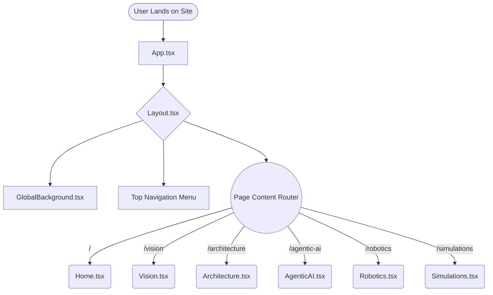
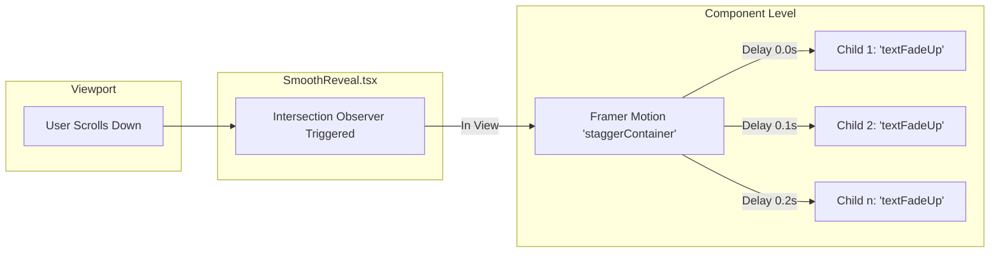

# Aegis Tower - Frontend Architecture & System Map

This document serves as the comprehensive architectural reference for the Aegis Tower frontend application. It outlines the complete file structure, UI components, application logic, and flowcharts describing user interactions.

---

## 1. Directory Structure

The application is built using a modern React + Vite + TypeScript stack, heavily utilizing Tailwind CSS and Framer Motion for its liquid-glass and DeepTech aesthetic.

```text
C:\FRAMEWORK(AI TOWER)\
├── public/
│   ├── documents/
│   │   └── mumbai_tower_audit.pdf      # Gated Lead-Magnet PDF Document
│   ├── favicon.svg                     # Site Favicon
│   └── icons.svg                       # Global SVG Sprite Map
├── src/
│   ├── App.css                         # Application-specific global styles
│   ├── index.css                       # Tailwind imports & Base CSS
│   ├── App.tsx                         # Core Router and Global Layout Wrapper
│   ├── main.tsx                        # React Entry Point (ReactDOM.createRoot)
│   ├── assets/                         
│   │   ├── hero.png                    # Hero section fallback image
│   │   ├── react.svg
│   │   └── vite.svg
│   ├── components/                     # Reusable UI & Logic Components
│   │   ├── AuditDownloadModal.tsx      # Secure Email Capture & Download Modal
│   │   ├── GlobalBackground.tsx        # Persistent Canvas/Video Background Layer
│   │   ├── Layout.tsx                  # Global Navigation & Top Bar
│   │   ├── SmoothReveal.tsx            # IntersectionObserver wrapper for scroll animations
│   │   └── Toast.tsx                   # Custom floating notification system
│   ├── pages/                          # Primary Route Components (Views)
│   │   ├── Home.tsx                    # Landing Page & Master Overview
│   │   ├── Vision.tsx                  # "The Vision" Storytelling & Modals
│   │   ├── Architecture.tsx            # Deep Dive into the 3-Tier Architecture
│   │   ├── AgenticAI.tsx               # Analytics, Data Matrices & Core Loop visualizations
│   │   ├── Robotics.tsx                # Information on the physical KUKA maintenance fleets
│   │   └── Simulations.tsx             # Interactive Threat Simulation Dashboard
│   └── styles/                         # Dedicated Style Modules
│       ├── fonts.css                   # Custom Font Declarations (Instrument Serif, etc.)
│       └── theme.css                   # Specialized CSS variables and Theme definitions
├── package.json                        # Dependencies (React, Framer Motion, Tailwind, Lucide)
├── tsconfig.json                       # TypeScript Configuration
├── vite.config.ts                      # Vite build and dev server configuration
└── tailwind.config.js                  # Tailwind definitions for liquid-glass and neon variants
```

---

## 2. Core Application Flow (Routing & Navigation)

The application utilizes a persistent Layout wrapper that contains the main Navigation Bar and Global Background. The `AnimatePresence` from Framer Motion orchestrates smooth transitions between pages.



---

## 3. Interactive Threat Simulation Flow (Simulations.tsx)

The Simulations page is the interactive core of the application, demonstrating the Central Agentic AI responding to simulated crises (Fire, Seismic, Grid Failure).

```mermaid
sequenceDiagram
    participant User
    participant Dashboard as Simulations.tsx
    participant State as React State
    participant Engine as Physics Engine (Simulated)

    User->>Dashboard: Clicks "Run Threat Simulation" (e.g. Seismic)
    Dashboard->>State: setActiveThreat("SEISMIC")
    Dashboard->>State: setIsSimulating(true)
    
    Dashboard->>Dashboard: Clear Terminal Output
    
    rect rgb(20, 20, 20)
    Note over Dashboard,Engine: Sequential Typing Effect (DeepTech Vibe)
    Engine-->>Dashboard: Stream "Threat Level Detected"
    Engine-->>Dashboard: Stream "Telemetry Analysis"
    Engine-->>Dashboard: Stream "PINN Thermodynamic Model"
    Engine-->>Dashboard: Stream "Agentic Dispatch Actions"
    end

    Dashboard->>State: setIsSimulating(false)
    Dashboard-->>User: Display Final State & Human Impact Result
    
    opt User Toggles Air-Gapped Mode
        User->>Dashboard: Clicks "Air-Gapped Engine" Toggle
        Dashboard->>State: setIsAirGappedMode(true)
        Dashboard-->>User: UI shifts to restricted mode (Custom Anomaly input opens)
    end
```



---

## 4. Lead Magnet Download Flow (AuditDownloadModal.tsx)

This flow tracks how users access the high-value gated PDF document using the custom modal and validation hooks.

```mermaid
flowchart TD
    Start([User clicks 'Download Audit']) --> OpenModal[Open AuditDownloadModal.tsx]
    OpenModal --> FillEmail[User enters Email Address]
    FillEmail --> Submit[Clicks 'Request Secure Download']
    
    Submit --> Validate{Corporate Domain?}
    
    Validate -->|No| ShowError[Display 'Invalid Corporate Email' Error]
    ShowError --> FillEmail
    
    Validate -->|Yes| SimulateAuth[Trigger 1.5s Authentication Delay]
    SimulateAuth --> PulseUI[Button shifts to 'Authenticating...']
    PulseUI --> Success[Auth Passed]
    
    Success --> DownloadLogic[Create temporary <a> element]
    DownloadLogic --> FetchPDF[Fetch /documents/mumbai_tower_audit.pdf]
    FetchPDF --> TriggerClick[Programmatic link.click()]
    TriggerClick --> Toast[Show Success Toast Notification]
    Toast --> CloseModal[Close Modal]
    CloseModal --> End([Download Initiated])
```

---

## 5. Animation Architecture (Micro-Cascades & Smooth Reveals)

The Aegis Tower utilizes Framer Motion to avoid browser main-thread locking by sequentially loading heavily styled glass components.



> [!TIP]
> **Performance Note**: Ensure that all `<motion.div>` tags are properly closed and that `variants` are strongly typed or cast as `any` in TypeScript to avoid Vite compilation errors when executing hot module reloads.
